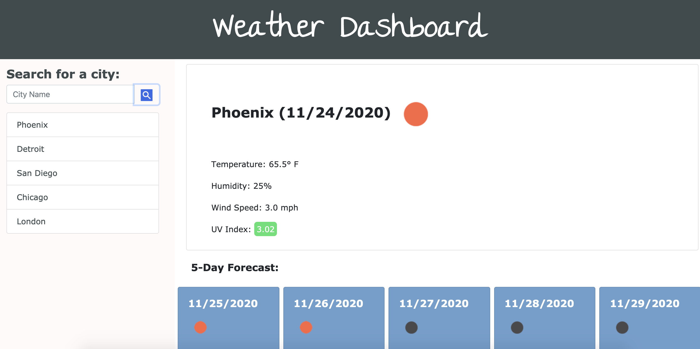

# weather-dashboard

For this project, I was required to create a web weather app using HTML, CSS & Javascript as well as API's. When a user searches a city, they are given the current temperature, humidity, wind speed and UV index. A five day forecast is displayed next to the city as well. User's city searches are saved on the left hand side.

# link to project:

https://jessm91.github.io/weather-dashboard/

